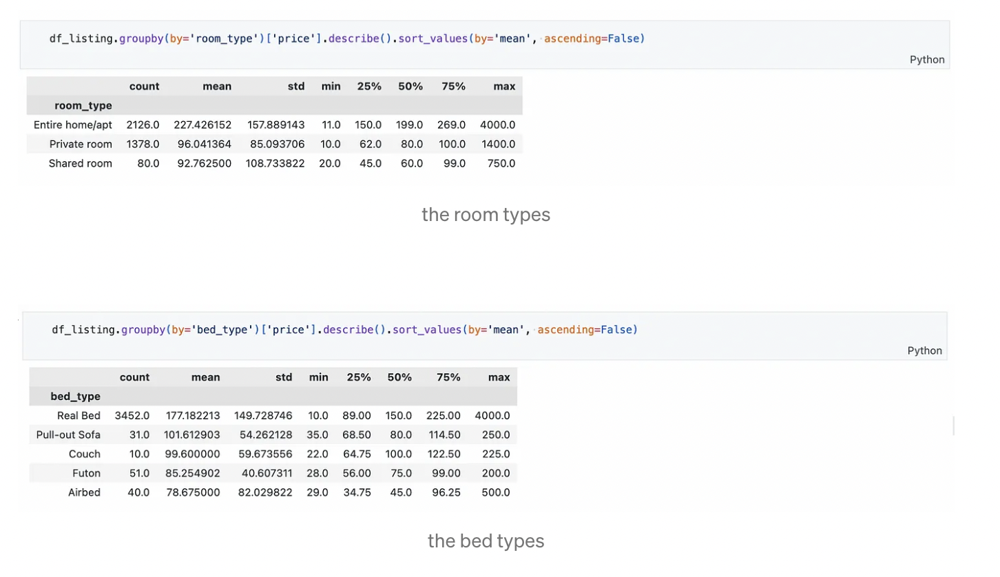

# Uncovering Insights From Airbnb's Boston Housing

The blog post is here: [Insights into the Boston Airbnb Market](https://medium.com/@chloenanh90/insights-into-the-boston-airbnb-market-218b8deed555)

This is a project for the Udacity Data Scientist Nanodegree, where the goal is to explore AirBnB Boston housing data and answer three questions of interest:

1. Are prices predominantly influenced by a listing's location or by its amenities and features?

2. What is the correlation between a listing's comments/reviews and the scores it receives?

3. How effective are the provided data attributes in predicting a listing's price?

### Installations

The project uses Python 3.9.7 and several libraries, including Pandas, Numpy, Sci-Kit Learn, and Matplotlib.

### Project Motivation

The main motivation for the project was to fulfill the requirements of the Udacity Data Scientist Nanodegree. To answer the questions of interest, the project uses data science and machine learning techniques.

### Descriptions

[uncovering-insights-from-airbnb-s-boston-housing.ipynb](https://github.com/chloehuang123/uncovering_insights_from_airbnbs_boston_housing/blob/main/uncovering-insights-from-airbnb-s-boston-housing.ipynb)

Data: boston_listings.csv, boston_reviews.csv, positive-words.txt:, negative-words.txt

**Q1. Are prices predominantly influenced by a listing’s location or by its amenities and features?**

We can now examine the features of each listing:

The Airbnb platform offers a wide range of property types for hosts to list, but it’s clear that apartments dominate the marketplace. With this in mind, we can delve deeper into the data to gain insights into pricing trends for this popular property type.

Let’s now examine the room and bed types.

We can gain further insights into prices by analyzing the ‘room_type’ and ‘bed_type’ variables, which can be transformed into numeric variables for easy analysis. To achieve this, we can map each unique value of the variables to a number based on their relative importance in affecting prices. For instance, we can assign higher valuations to ‘Entire home/apt’ than ‘Private room’ or ‘Shared room’, and ‘Real Bed’ over ‘Pull-Out Sofa’, ‘Couch’, ‘Futon’, and ‘Airbed’. The exact numbers assigned to each valuation are not significant, as the focus is on the overall relationship between the variables and prices. While conducting a survey to determine the precise values guests place on different rooms or beds could improve this study, for now, we will proceed with the assigned valuations.

Now, to determine the total value of a listing’s features and amenities, we can simply add all these variables up into one figure:

Based on the results, it can be concluded that the deviation size for the Features and Amenities is 10% greater than the deviation size for the City. This indicates that the prices in the dataset are slightly more dispersed with respect to the characteristics such as amenities, etc., compared to the location of the listing. However, the difference in concentration is not significant.

**Q2. What is the correlation between a listing’s comments/reviews and the scores it receives?**

To answer this question, we need to import data from two files that contain dictionaries of positive and negative words. These files will help us compare the words in each listing review to the dictionaries and calculate a score indicating the positivity or negativity of the reviews. We can then correlate this score with the review_score_rating of the listing to find the answer to our question.

Based on the obtained answers, it seems that there is a weak correlation between the price of a listing and the sentiment expressed in its reviews. Additionally, the sentiment of the reviews does not seem to have a strong correlation with the rating of the listing. These results suggest that the current method used to evaluate the sentiment in the reviews may not be optimal.

Moreover, the findings imply that guests often provide insufficient information in their comments regarding why they rated a listing in a particular way. This underscores the importance of positive comments for AirBnB hosts. Since guests tend to provide limited information in their comments, the interpretation of these comments by potential guests browsing the listing online can be highly subjective. Given the unpredictable nature of human subjectivity and the tendency to make inferences based on limited information, Airbnb hosts should aim to avoid negative comments that could have an overwhelming impact on how they are perceived.

**Q1. How effective are the provided data attributes in predicting a listing’s price?**

For the first model, we will be using a Support Vector Machine Regressor, and fine-tuning it using Grid Search Cross-Validation:

For the first model, we will be using a Support Vector Machine Regressor, and fine-tuning it using Grid Search Cross-Validation:

Based on the results above, the SVM showed the best performance. However, the difference between the obtained result and the mean prices for each property type implies that the model could benefit from more advanced training methods, a larger dataset, and more complex architectures.

Given that the current dataset is relatively small, future exploration could involve larger datasets encompassing various cities and countries to determine how global trends in the AirBnB market affect prices across the globe.

Nevertheless, these models provide a solid foundation for the notion that the features in the dataset indeed contain patterns that impact the price of a listing. As such, they encourage future attempts at identifying such patterns by incorporating additional variables (internal or external) into the dataset or engineering features differently. The possibilities are endless.
